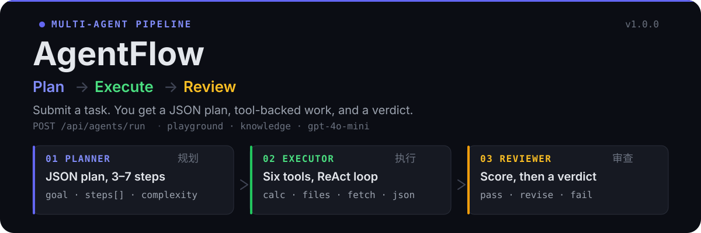
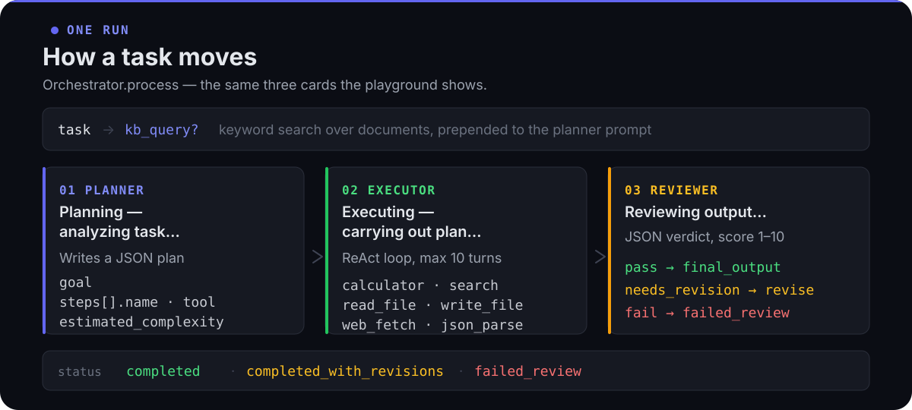

<p align="center">
  
</p>

Submit a task. Three agents handle it in order:

1. **Planner** writes a JSON plan: `goal`, 3–7 `steps` (name, action, optional tool), `estimated_complexity`.
2. **Executor** carries the plan out with six tools in a ReAct loop (max 10 turns).
3. **Reviewer** returns `pass`, `needs_revision`, or `fail`, with a 1–10 score and an optional `revised_output`.

The React playground shows those three artifacts as cards. If you pass `kb_query`, stored documents are keyword-searched and prepended to the planner prompt.

<p align="center">
  
</p>

## What is in the box

- **Orchestrator** — `Plan → Execute → Review` in `backend/app/agents/orchestrator.py`
- **Tools** — `calculator`, `search`, `read_file`, `write_file`, `web_fetch`, `json_parse`
- **API** — FastAPI on `:8000`, including streaming chat
- **UI** — React dashboard: Agents, Playground, Knowledge (`:3000`, Vite proxies `/api`)
- **Store** — SQLite (SQLAlchemy async) for tasks; knowledge documents in `knowledge_base.json`

## Run it

### Backend

```bash
cd backend
pip install -r requirements.txt

export OPENAI_API_KEY=sk-your-key
# optional
export OPENAI_BASE_URL=https://api.openai.com/v1
export AGENTFLOW_LLM_MODEL=gpt-4o-mini

python run.py
```

Server: [http://localhost:8000](http://localhost:8000) · OpenAPI: [http://localhost:8000/docs](http://localhost:8000/docs)

### Frontend

```bash
cd frontend
npm install
npm run dev
```

Opens [http://localhost:3000](http://localhost:3000). Go to **Playground**, describe a task, optionally add a knowledge-base query, then **Execute Pipeline**.

| Variable | Default | Role |
|---|---|---|
| `OPENAI_API_KEY` | — | API key (required) |
| `OPENAI_BASE_URL` | `https://api.openai.com/v1` | Any OpenAI-compatible endpoint |
| `AGENTFLOW_LLM_MODEL` | `gpt-4o-mini` | Model name (`AGENTFLOW_` prefix) |

## Limits

These are how the repo actually behaves:

- **`search` is simulated.** It returns placeholder JSON. Wire a real search API before relying on it.
- **Knowledge base is keyword search**, not embeddings. `KnowledgeBase.search` scores term counts over a JSON file.
- **File tools are unsandboxed.** `read_file` / `write_file` use the local filesystem.
- **Direct chat** (`POST /api/agents/chat`) skips the pipeline and talks to the Executor only.

## API

| Method | Path | What it does |
|---|---|---|
| `GET` | `/api/agents/` | List Planner, Executor, Reviewer |
| `POST` | `/api/agents/run` | Run the pipeline (`task`, optional `kb_query`) |
| `POST` | `/api/agents/chat` | Direct Executor chat (`stream` supported) |
| `GET` | `/api/agents/tools` | List tool specs |
| `GET` | `/api/tasks/` | Task history |
| `POST` | `/api/tasks/` | Create a task record |
| `GET` | `/api/knowledge/` | List documents |
| `POST` | `/api/knowledge/` | Add a document |
| `POST` | `/api/knowledge/search` | Keyword search |

## License

MIT
